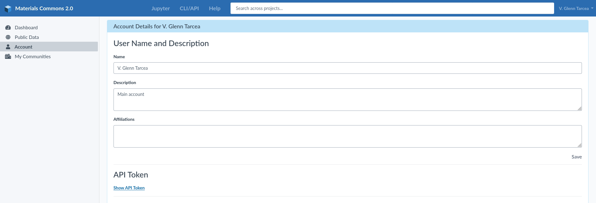

.. manual/connect.rst

Initializing the API
================================

To make use of the API you must first initialize an instance of the client. To initialize the client you can either
pass in your account email address and password, or use your API Token. The API Token is a convenient way to connect
initialize the client. You can find your API Token by going to your account details screen on the Materials Commons
website as shown here:

Under the section API Token there is a link to display your API Token titled "Show API Token". Click on this to
view and copy your token. Once you have your API Token you can initialize the client as follows: ::

    import materials_commons.api as mcapi
    c = mcapi.Client("your-api-token-here")

Specifying the URL
------------------

By default the API will connect to the following instance of Materials Commons: ``https://materialscommons.org/api``. If
you want to connect to a different instance of Materials Commons you can specify the ``base_url`` when instantiating the
client. For example, if you were running a local instance of Materials Commons on port 8000: ::

    import materials_commons.api as mcapi
    c = mcapi.Client("your-api-token-here", base_url="http://localhost:8000/api")

When specifying the URL it is important that it ends with ``/api``, for example ``http://localhost:8000/api`` or
``https://materialscommons.org/api``.

Using your email/password
-------------------------

As an alternative you can specify your email and password. Though this is not recommended it can be a convenient way
to connect up if you don't have easy access to your API Token, or if you just want to perform a quick operation: ::

    import materials_commons.api as mcapi
    c = mcapi.Client.login("myemail@email.com", "my-password")

The ``login()`` method also accepts the optional ``base_url`` argument to connect up to a different instance of the
Materials Commons server.

Protecting your API Token
-------------------------

Your API Token gives full access to your data on Materials Commons. If you are writing scripts you don't want to include
the token in the scripts. One way to access your token is to place it in an environment variable. For example on Linux
or Mac based systems, if you are using the bash shell you can add the following line to your .bashrc: ::

    export MC_API_TOKEN="your-api-token-here"

Then you can import pythons ``os`` package to access your token as shown here: ::

    import materials_commons.api as mcapi
    import os

    c = mcapi.Client(os.getenv("MC_API_TOKEN"))

This provides access to your API Token while also keeping it out of your script code.
